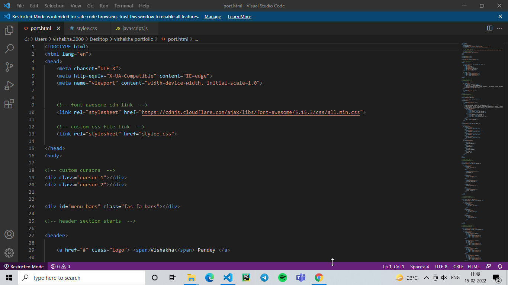
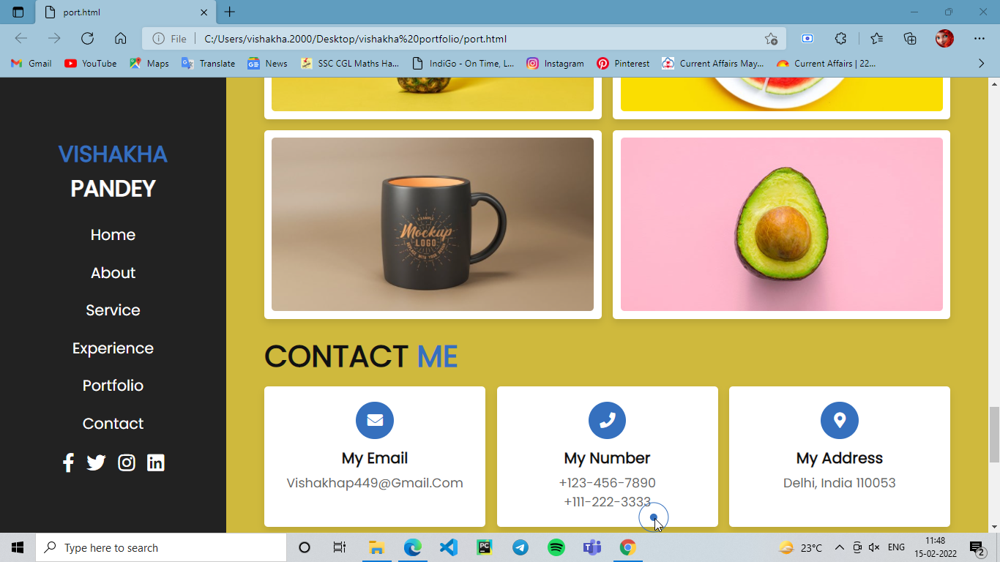

# portfolio
# FUTURE READY TALENT VIRTUAL INTERNSHIP PROJECT

## PROJECT NAME - My Portfolio website hosted using static web app .

 - You can check working azure function app by this http trigger :- https://salmon-plant-0a813d300.1.azurestaticapps.net

## Resources used:
   - Azure Resources
   - Visual studio code
   - Azure Static Web App
## Problem Statement/Opportunity :
- In this project i will face difficulty during deployment. so with the help of mentoring session i deployed my website easily. so it will take more to complete the project. however we can use cloud computing means like Azure service. they have inbuilt services so have to only connect. so we can easily complete our project work.
- There are lots of opportunity over there i will know about bot services, hosting services machine learning etc.

## Project Description :
- deploy website using static web app.
- I will getting free hosting services for a while with free domain name.
- In this project i will using HTML, CSS, JavaScript, jQuery etc. 

## Below you will find sample images :)

### CODE SNIPPET

### DEPLOYMENT

### RESOURSE GROUP

### STATIC WEB APP

###  Website look

### GITHUB REPO...

# Thank You :)

- Vishakha Pandey
- vishakhap449@gmail.com
